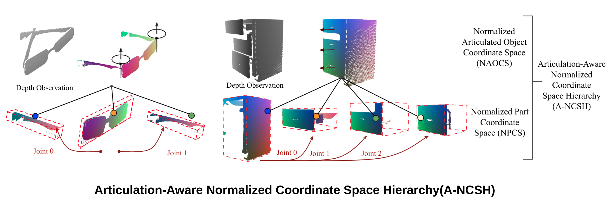

# ANCSH_Pytorch (Category Level Articulated Object Pose Estimation Pytorch)

## Overview 
This repository contains the implementation of the paper *[Category-Level Articulated Object Pose Estimation](https://arxiv.org/abs/1912.11913)*  
Checkout the official code release for the paper at [dragonlong/articulated-pose](https://github.com/dragonlong/articulated-pose)..
<p align="center"></p>

[Paper](https://arxiv.org/abs/1912.11913)&nbsp; [Website](https://articulated-pose.github.io/)

## Content
- [Additional Repo](Additional-Repo)
- [Setup](#Setup)
- [Dataset](#Dataset)
- [Pretrained Models](#Pretrained-Models)
- [Training](#Training)
- [Inference & Optimization](#Inference&Optimization)
- [Evaluation & Visualization](#Eveluation&Visualization)

## Additional-Repo

- OPD: In this paper, we reimplement ANCSH using PyTorch for a comparison. For details, check the [OPD](https://3dlg-hcvc.github.io/OPD/) website.

## Setup
The implementation has been tested on Ubuntu 20.04, with PyTorch 1.7.1, CUDA 11 and CUDNN 8.0.3.

* Clone the repository
```sh
git clone git@github.com:3dlg-hcvc/ANCSH-pytorch.git
```
* Setup python environment
```sh
conda create -n ancsh python=3.7 
conda activate ancsh  
pip install -e .
pip install -r requirements.txt
pip install "git+git://github.com/erikwijmans/Pointnet2_PyTorch.git#egg=pointnet2_ops&subdirectory=pointnet2_ops_lib"
```
(If meeting `unauthenticated git protocol on port 9418` ), run `git config --global url."https://".insteadOf git://` for above last command to install pointnet2_ops_lib)

## Dataset
You can download the original processed `[eyeglasses]` (eyeglasses_ancsh) and our `[OneDoor]` (dataset) [dataset](https://aspis.cmpt.sfu.ca/projects/motionnet/opd/dataset/ANCSH/dataset.tar.gz) for ANCSH to **./dataset** folder (there is one dataset.tar.gz under /dataset/ANCSH).

## Pretrained-Models
You can download our pretrained [models](https://aspis.cmpt.sfu.ca/projects/motionnet/opd/models/ANCSH/models.tar.gz) to **./models** folder (there is one models.tar.gz under /models/ANCSH).

`[eyeglasses-ancsh]`&nbsp;&nbsp;&nbsp;&nbsp;&nbsp;`[eyeglasses-npcs]`

`[onedoor-ancsh]`&nbsp;&nbsp;&nbsp;&nbsp;&nbsp;`[onedoor-npcs]`

## Training
To train from the scratch, you can use below commands. For this paper, we need to train two independent models (ANCSH, NPCS), and combine their results as final results. (We have got the author's reply on the details)

We use hydra in this project, please modify the config files in `configs/paths` to change the path setting (Refer to cc_ancsh.yaml and cc_npcs.yaml).

* Train the two models
    ```
    python train.py \
    network=<NETWORK_TYPE> \
    paths=<PATH_CONFIG_OPTION> \
    train.input_data=<PATH_TO_TRAIN_DATA> \
    test.input_data=<PATH_TO_TEST_DATA> 
    ```
    * Network Type:
        * ANCSH Model:
            * network=ancsh
        * NPCS Model:
            * network=npcs
    * Dataset:
        * Eyeglasses: (The same split to original ANCSH paper)
            * train.input_data=<PATH_TO_REPO>/dataset/eyeglasses_ancsh/train.h5
            * test.input_data=<PATH_TO_REPO>/dataset/eyeglasses_ancsh/test.h5
        * OneDoor: 
            * train.input_data=<PATH_TO_REPO>/dataset/OneDoor/train.h5
            * test.input_data=<PATH_TO_REPO>/dataset/OneDoor/val.h5
    

## Inference&Optimization 

* Inference with pretrained Model
    ```sh
    python train.py \
    network=<NETWORK_TYPE> \
    paths=<PATH_CONFIG_OPTION> \
    train.input_data=<PATH_TO_TRAIN_DATA> \
    test.input_data=<PATH_TO_TEST_DATA> 
    eval_only=true \
    test.inference_model=<PRETRAINED_MODEL>
    ```
    The options are the same to above.

* Optimization 
    ```
    python optimize.py \
    paths=<PATH_CONFIG_OPTION> \
    ancsh_results_path=<ANCSH_RESULTS> \
    npcs_results_path=<NPCS_RESULTS> \
    num_parts=<NUM_PARTS>
    ```
    The options are the same to above.
    The results file are from the inference of above two models.
    * Dataset:
        * Eyeglasses: (The same split to original ANCSH paper)
            * num_parts=3
        * OneDoor: 
            * num_parts=2

* Evaluation with original ANCSH evaluation metric
    ```
    python evaluate.py \
    paths=<PATH_CONFIG_OPTION> \
    optimization_result_path=<PATH_TO_OPTIMIZATION_RESULT> \
    num_parts=<NUM_PARTS>
    ```
    The options are the same to above.

## Evaluation&Visualization
You can ignore this section if you want to use ANCSH directly without considering [OPD](git@github.com:3dlg-hcvc/OPD.git).

We convert the results of OneDoor dataset into [OPD](git@github.com:3dlg-hcvc/OPD.git) inference results format, evalaute and visualize using the code from [OPD](git@github.com:3dlg-hcvc/OPD.git)

* Get the `prediction.h5` from above evaluation, and conver the results into OPDRCNN format (Use the code from [OPD](git@github.com:3dlg-hcvc/OPD.git)). Need to download the dataset for OPDRCNN in [OPD](git@github.com:3dlg-hcvc/OPD.git).)
  ```
  python <PATH_TO_OPD>/ANCSH_convert_results.py \
  --ancsh-result-path <PATH_TO_FINAL_RESULT> \
  --data-path <PATH_TO_DATASET>
  * Dataset:
    * OneDoor Data:
      * --data-path <PATH_TO_REPO>/dataset/MotionDataset_h5_ancsh
* After converting, get the inference file in the [OPD](git@github.com:3dlg-hcvc/OPD.git) format, check `Evaluation` in README of 
[OPD](git@github.com:3dlg-hcvc/OPD.git). (Use `--inference-file` option, change the dataset to `MotionDataset_h5_ancsh`)